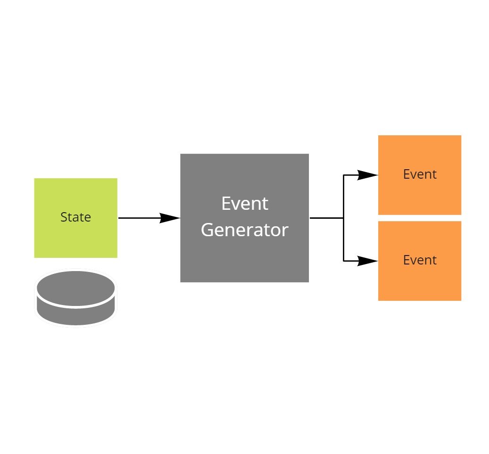

# Implementing an event generator

This project is part of the [MessageHandler processing patterns](https://www.messagehandler.net/patterns/) library.

MessageHandler is distributed under a commercial license, for more information on the terms and conditions refer to [our license page](https://www.messagehandler.net/license/).

## What is an event generator

An event generator reports changes in state as events towards the rest of the system.



## When to use it

The typical use for event generators is to report state changes, in the real world, as they are picked up by sensors.

But also virtual event generators can be usefull to detect changes in databases, so called change data capture.

## What you need to get started

- The [.NET 6 SDK](https://dotnet.microsoft.com/en-us/download) should be installed
- The sample was created using [Visual Studio 2022 community edition](https://visualstudio.microsoft.com/vs/).
- To send events an [event hubs namespace](https://learn.microsoft.com/en-us/azure/event-hubs/event-hubs-create) is used.
- The **MessageHandler.Runtime.StreamProcessing** package is available from [nuget.org](https://www.nuget.org/packages/MessageHandler.Runtime.StreamProcessing/)

## Running the sample

Prior to being able to run the sample, you need to [configure the user secrets file](https://docs.microsoft.com/en-us/aspnet/core/security/app-secrets?view=aspnetcore-6.0&tabs=windows#manage-user-secrets-with-visual-studio).

In the secrets file you must specify the following configuration values.

```JSON
{
  "eventhubsnamespace": "your event hubs connection string goes here"
}
```

TODO

## Designed with testing in mind

MessageHandler is intented to be test friendly.

This sample contains plenty of ideas on how to test dispatching from an event generator without requiring a dependency on an actual broker instance, and thus keep the tests fast.

- [Component tests](https://github.com/MessageHandler/MessageHandler.Quickstarts.EventGenerator/tree/master/src/Tests/ComponentTests): To test the interaction between the event generator and the dispatching infrastructure.
- [Contract tests](https://github.com/MessageHandler/MessageHandler.Quickstarts.EventGenerator/tree/master/src/Tests/ContractTests): To verify that the test doubles used in the component tests are behaving the same as an actual dependency would. Note: contract verification files are often shared between producers and consumers of the contract.

## How to implement it yourself

Check out [this how to guide](https://www.messagehandler.net/docs/guides/stream-processing/configuration/) to learn how to configure a reaction yourself.